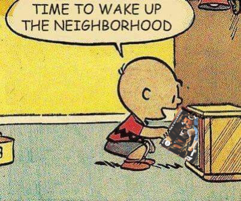

# Time to wake up the neighborhood maker

A tool that renders an album cover on top of a "time to wake up the neighborhood" template image.

## build

``go build .``

## Usage:

``./wakeup -j $PATH_TO_ALBUM_COVER -o $PATH_TO_OUT_FILE [-t $PATH_TO_TEMPLATE_FILE]``
